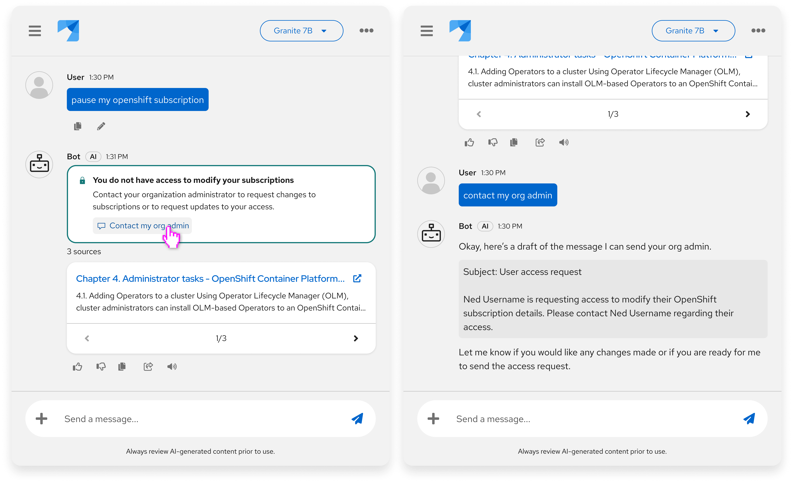
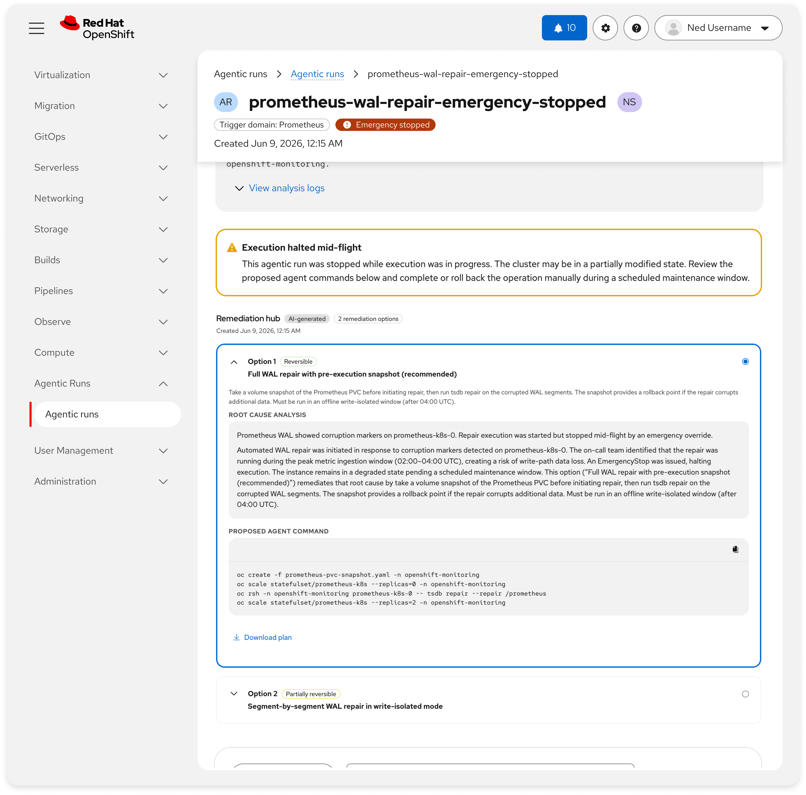
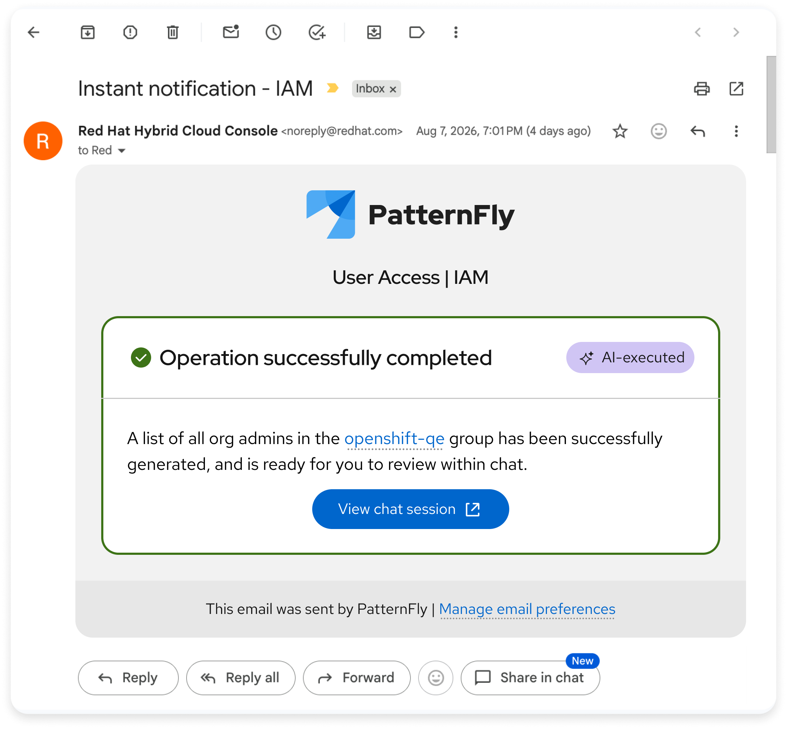

# Alert messages

## Overview
Alert messages communicate AI failures, stalled operations, completions, and other changes in state warranting increased user awareness of. These alerts can be used in any context (chatbots, in-page AI analyses, etc.) and should clearly and constructively by explaining what went wrong, why it happened, and what users can do next. Wherever possible, an error should be paired with the ability to show the error details and/or fix the problem.

---
## Purpose and value
- **Reduce recovery time:** State what failed and what to try next so users can unblock quickly (, OpenShift Lightspeed telemetry)
- **Preserve trust:** Be honest about AI limits and never fabricate causes for failures. Never hallucinate an explanation of the failure itself
- **Clarify responsibility:** Make clear whether the AI, the system, or the user's input caused an operation to take place and, whenever possible, call out next steps that the user, or someone else in their organization, should take
- **Deflect support load:** Route users to docs, troubleshooting guides, or retry paths before escalating
- **Improve scanability:** Make key operation state changes (unexpected stalling, timeouts, failures, and successes) obvious to the user. ([Designing UX for AI Errors](https://www.uxstalwarts.com/blog/designing-ux-for-ai-errors-how-to-handle-failures-the-right-way/))
---
## When to use
- **The AI can't finish a request:** Timeouts, model or network failures, or missing capabilities. See  for details. ([What Should an AI App Show When the Model Fails](https://ai-tldr.dev/learn/building-ai-apps/ai-ux-patterns/ai-error-state-design/))
- **External tool or service issues:** APIs, MCP tools, or cluster resources are down or unreachable. ([What Should an AI App Show When the Model Fails](https://ai-tldr.dev/learn/building-ai-apps/ai-ux-patterns/ai-error-state-design/))
- **Low confidence or unknown answers:** Be clear when the AI doesn't know the answer instead of guessing.
- **Access, policy, or input errors:** User lacks permissions, actions violate policies, or uploaded files/inputs are unsupported. ([What Should an AI App Show When the Model Fails](https://ai-tldr.dev/learn/building-ai-apps/ai-ux-patterns/ai-error-state-design/))
- **Partial success:** Clearly distinguish what worked from what failed. ([Silence Is a Design Decision](https://www.thetruecode.com/the-true-code-of-production-systems/silence-is-a-design-decision/))
- **Clear warning levels:** Make non-blocking warnings and hard errors visually distinct.
- **Major task completion:** Notify the user when a high-impact or resource-intensive operation finishes successfully. ([Success Message UX Examples & Best Practices](https://www.pencilandpaper.io/articles/success-ux))
---
## When not to use
- **Loading states or user cancellations:** Use progress indicators for transient loading instead of error messages. Do not treat deliberate user exits (like stopping or pausing) as failures; if a multi-step operation is canceled mid-execution, clearly show what was completed versus what was aborted. ([Notifications UI design](https://www.setproduct.com/blog/notifications-ui-design))
- **Internal debug detail for end users:** Keep stack traces and raw codes in expandable technical details or logs, not the primary message. Consider Audit trails instead for deep diagnostics
- **When a silent retry will succeed quickly:** Prefer automatic recovery with optional status, then escalate to an error only if recovery fails ([What Should an AI App Show When the Model Fails](https://ai-tldr.dev/learn/building-ai-apps/ai-ux-patterns/ai-error-state-design/))
---
## Examples and visualizations
*Screenshots below may not match existing implementations in products.*

#### General example
In both chatbots and in-context AI experiences, the recommendation is to explain the error or issue with an [alert](https://www.patternfly.org/components/alert/html/#alert-examples), following the PatternFly [severity guidelines](https://www.patternfly.org/patterns/status-and-severity) based on the content of the messaging. Whenever possible, the alerts should recommend a way to remedy the issue.

For this particular ‘user does not have access’ example, the teal outlined ‘custom’ alert severity since a lack of access is not stately in nature. A lack of access is neither erroneous nor successful, so it is either informational or custom. Learn more about [status and severity colors](https://www.patternfly.org/foundations-and-styles/colors#status-and-state-colors).

#### OpenShift’s ‘Agentic run details’
When a user looks at details of an ‘Agentic run’, they see various AI analyses, recommendations, and errors when applicable. In this particular example, recommended actions are displayed below the [alert](https://www.patternfly.org/components/alert/html/#alert-examples) in the ‘Remediations hub’ section due to the size of the recommendation actions. <a href="#assumptions" class="assumption-marker" style="color:#ee0000;font-weight:700;text-decoration:none">*</a>

#### Hybrid Cloud Console’s third-party alerts
Our users often rely on third party tools outside of our technical consoles to get alerted of things happening within our products. This applies to operations and events being executed by AI. This example shows how we can apply the ‘essence’ of this alert messaging standard, while likely being limited on the exact styling within third party tools like email, Slack, GChat, Microsoft Teams, etc.

---
## Recommended components
- **[Alert](https://www.patternfly.org/components/alert/html/#alert-examples):** An alert is a non-intrusive notification that shares brief, important messages with users. For displaying error messages within chatbots, refer to the ‘[bot messages with error](https://www.patternfly.org/extensions/chatbot/messages#bot-messages)’ example in the PatternFly chatbot extension.
- **[Failed attachment error pattern](https://www.patternfly.org/extensions/chatbot/messages#failed-attachment-error):** In a chatbot, when an attachment upload fails, a danger alert is displayed to provide details about the reason for failure. Note: This example is visualizing how a chatbot should display alerts, but is not specifically calling out when AI itself has made an error.
- **[Severity](https://www.patternfly.org/patterns/status-and-severity):** Providing users with clearly defined status and severity states is essential when sharing important context about their data streams and systems.
---
## Related standards
-
-
- Code execution results
-
-
---
## Assumptions and research questions

#### Assumptions
Assumptions are indicated with <a href="#assumptions" class="assumption-marker" style="color:#ee0000;font-weight:700;text-decoration:none">*</a> throughout the standard.
- **[Example visualizations](#examples-and-visualizations):** OpenShift’s ‘Agentic run details’
#### Research questions
- This is more of a technical capability than a UX research question but it has direct UX implications: can AI realistically determine when it does not have enough reliable information to give a correct answer?
- Does the AI alert messages make key operation state changes (unexpected stalling, timeouts, failures, and successes) obvious to the user?
#### Metrics to track
1. Error recovery rate: % of users who successfully complete their task after encountering an AI error, without escalating to support. Baseline from Ask Red Hat: 98.6% deflection rate.
2. Time to recovery: Median seconds from error display to next user action. Shorter times indicate clear, actionable error messages.
3. Support escalation rate: % of AI errors that result in a support ticket.
