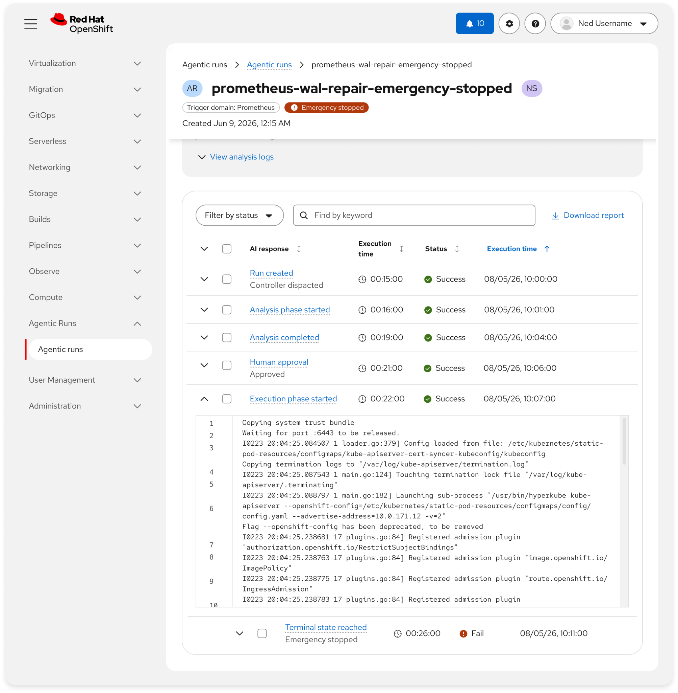
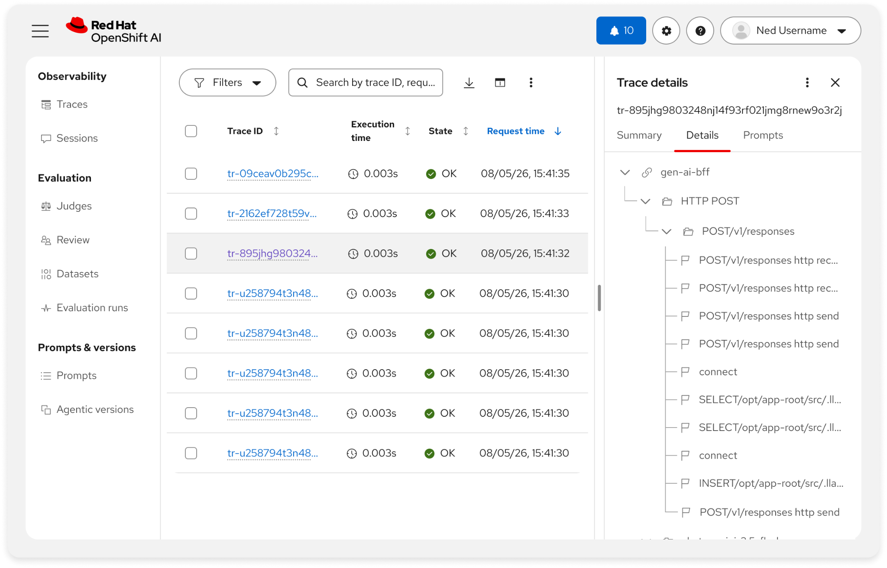
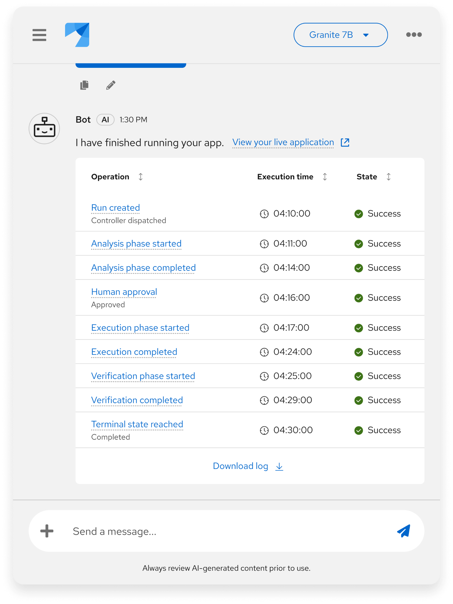

# Audit trails

## Overview
Audit trails record and display a transparent history of AI actions, decisions, user interactions, and reasoning and data wherever possible for accountability and learning. Unlike, which streams reasoning in real time, audit trails surface rationale after the fact — helping users verify, defend, and act on AI-driven decisions with confidence. They make AI behavior observable after the fact by logging what happened, when, why, and who was involved — and by clearly distinguishing AI actions from human ones.

---
## Purpose and value
- **Accountability:** Create a durable record of who did what, when, and a clear indication of actions taken by AI versus actions carried out manually by a.
- **Transparency:** Make AI decisions, reasoning, and confidence levels reviewable after the interaction
- **Learning, debugging, and troubleshooting:** Trace unexpected outcomes, correlate AI actions with system events, improve processes over time, and provide root cause analyses for troubleshooting
- **Compliance:** Support regulatory and organizational oversight requirements with searchable, retainable history
- **Trust:** Build confidence by making otherwise invisible AI agency visible and filterable
---
## When to use
- **Providing a history of actions taken and even proposed by the AI system:** Log agent steps, tool calls, recommendations applied, and resource changes recorded after the fact. For live visualizations of actions, consider using. <a href="#assumptions" class="assumption-marker" style="color:#ee0000;font-weight:700;text-decoration:none">*</a>
- **Human–AI collaborative decisions:** Record what the AI suggested, what the human approved/changed, and the exact timestamp
- **High-stakes or governed workflows:** Identify a root cause from large volumes of data (e.g., isolating a single file from a 6-7GB log dump), show which data points the AI examined and why it narrowed to its conclusion <a href="#assumptions" class="assumption-marker" style="color:#ee0000;font-weight:700;text-decoration:none">*</a>
- **Permissions and backend actions:** Capture grants, denials, and actions taken on behalf of the user <a href="#assumptions" class="assumption-marker" style="color:#ee0000;font-weight:700;text-decoration:none">*</a>
- **Lineage and provenance needs:** Backtrack from outcome to model, run, dataset, or prompt version
- **Multi-user or multi-session work:** Clarify “who did what” across teammates and time
---
## When not to use
- **Raw technical telemetry only:** Do not treat stack traces or infrastructure events as a substitute for contextual audit history. Pair technical logs with decision context, or keep them in operational monitoring. <a href="#assumptions" class="assumption-marker" style="color:#ee0000;font-weight:700;text-decoration:none">*</a>
- **Real-time reasoning visibility:** Loading states, transient progress, and short-lived status toasts are not audit trails. Use progress indicators instead. In this scenario, refer to the. <a href="#assumptions" class="assumption-marker" style="color:#ee0000;font-weight:700;text-decoration:none">*</a>
- **Unsearchable or inaccessible dumps:** If users and auditors cannot find, filter, or retain the history, it fails the pattern. Design for discoverability and retention first. <a href="#assumptions" class="assumption-marker" style="color:#ee0000;font-weight:700;text-decoration:none">*</a>
- **Privacy-sensitive detail without controls:** Do not expose full prompts, PII, or secrets in unrestricted audit UIs. Apply RBAC, redaction, and retention policies. <a href="#assumptions" class="assumption-marker" style="color:#ee0000;font-weight:700;text-decoration:none">*</a>
- **Disposable scratch interactions:** Purely exploratory local experiments with no accountability need may not warrant durable trails; prefer session history or version history patterns instead when lighter weight fits. <a href="#assumptions" class="assumption-marker" style="color:#ee0000;font-weight:700;text-decoration:none">*</a>
- **Confidence scoring is the real need:** When users primarily need to know how certain the AI is (not why), use Confidence Indicators instead. Explainability answers "how did you get here?"; confidence answers "how sure are you?" <a href="#assumptions" class="assumption-marker" style="color:#ee0000;font-weight:700;text-decoration:none">*</a>
---
## Examples and visualizations
*Screenshots below may not match existing implementations in products.*

#### OpenShift’s ‘Agentic run details’
It is recommended that a [table](https://www.patternfly.org/components/table) be used to display a chronology of running actions, stuck items, and other data related AI behavior.

The example below includes key data in the table rows themselves, offers expansion to display any additional details that may be needed for auditing and accountability purposes, toolbar actions for filtering large datasets, and a download action. A [tree table](https://www.patternfly.org/extensions/data-view/table/#tree-table) can also be considered when the audit trails are stored in a nested structure. <a href="#assumptions" class="assumption-marker" style="color:#ee0000;font-weight:700;text-decoration:none">*</a>

#### OpenShift AI’s ‘Experiments’ tracing feature
Users can view a historical log of all traces from all agent experiences within the GenAI Studio Playground in one [table view](https://www.patternfly.org/components/table) regardless of the chat session. You may choose to forego the expandable row functionality in favor of clickable cell content that triggers open a drawer for larger tracing details. Refer to the [primary detail pattern](https://www.patternfly.org/patterns/primary-detail/react-demos/primary-detail-full-page/). <a href="#assumptions" class="assumption-marker" style="color:#ee0000;font-weight:700;text-decoration:none">*</a>

#### General chatbot example
While more robust tables are better suited for full page rendering, you may also use audit trails in chatbots by showing fewer columns and making data more condensed.

---
## Recommended components
- **[Table](https://www.patternfly.org/components/table):** A table displays large data sets in a simple grid with column headers.
- **[Log snippet](https://www.patternfly.org/extensions/component-groups/log-snippet/#basic-log-snippet):** A log snippet component provides a way to display a log snippet or code along with a message.
- **[Primary detail](https://www.patternfly.org/patterns/primary-detail/react-demos/primary-detail-full-page/):** A primary-detail layout is an interface that shows a list of items and the corresponding details of the selected item.
---
## Related standards
-
-
- Code execution results
-
-
---
## Notes for PatternFly
The following explainability/audit trails needs are not fully covered by existing PatternFly components and may require net-new design work:

- **Factor importance with magnitude:** Ranked list of contributing factors with relative weight or contribution percentage. Description List approximates the structure but lacks visual weight indicators.
- **Counterfactual / "what-if" framing:** Showing how a decision would change under different conditions. No component natively communicates the hypothetical nature of alternative scenarios.
- **Inline source highlighting:** Annotating specific text spans within a content block to show which words or passages contributed to a conclusion. Requires interaction design for click-to-trace behavior.
- **Provenance chain node types:** While Compass + React Flow provides the canvas, purpose-built node types for data lineage steps (source, transformation, model inference, output) do not yet exist.
---
## Assumptions and research questions

#### Assumptions
Assumptions are indicated with <a href="#assumptions" class="assumption-marker" style="color:#ee0000;font-weight:700;text-decoration:none">*</a> throughout the standard.
- **[When to use](#when-to-use):** AI takes or proposes actions, High-stakes or governed workflows, Permissions and backend actions
- **[When not to use](#when-not-to-use):** Raw technical telemetry only, Real-time reasoning visibility, Unsearchable or inaccessible dumps, Privacy-sensitive detail without controls, Disposable scratch interactions, Confidence scoring is the real need
- **[Example visualizations](#examples-and-visualizations):** OpenShift’s ‘Agentic run details’, OpenShift AI’s ‘Experiments’ tracing feature
#### Research questions
1. When investigating an unexpected AI outcome, can users trace from the outcome back to the AI decision that caused it?
2. After reviewing an audit trail, do users report higher confidence in the AI system?
3. Audit trail usage rate: % of users who access audit trail views after AI-assisted workflows. (Indicates whether users find audit trails valuable or ignore them.)
4. Time to find information: How long does it take a user to locate a specific AI action in the audit trail? (Tests searchability and filterability.)
