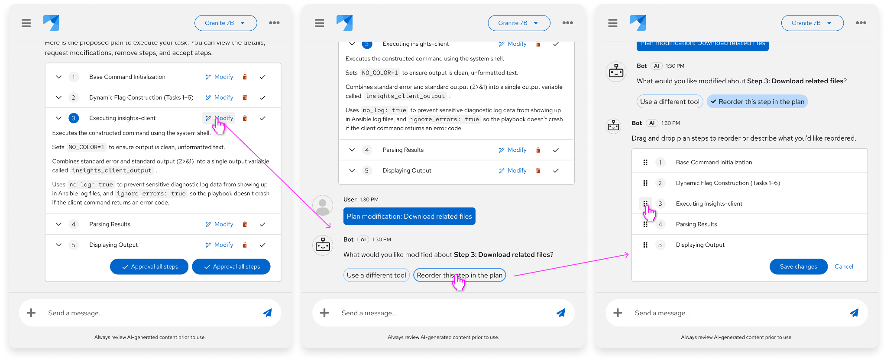

🚧 <strong><em style="color:#c86500">Work in progress</em></strong> <em>(remove when ‘done’)</em>

# Plan approval

## Overview
Plan approval is a multi-step review workflow that lets users inspect, edit, and approve an AI-proposed sequence of actions before the agent runs it. It typically appears in agentic assistants, Lightspeed experiences, and other areas where the AI would otherwise call tools or change systems autonomously. The defining trait is that the full plan is visible and editable first — not a single yes/no gate after the fact.

---
## Purpose and value
- **Preview before execution:** Show the entire proposed sequence so users can see what will happen before anything runs.
- **Editable plans:** Let users reorder steps, add or remove tasks, and edit parameters instead of taking the plan as-is.. Allowing modification at the step level ensures users are not forced into all-or-nothing consent
- **Risk and cost in view:** Display estimated costs, blast radius, and risks next to the plan so users can choose whether to run it or try a different path.
- **Progress against the plan:** After approval, show execution status against the agreed steps so the live run stays comparable to what the user signed off on. To achieve this, follow up the approved plan with  to track the status of the plan steps.
- **Rollback confidence:** Pair the plan with a clear recovery path. Users asked for guaranteed rollbacks when an approved sequence goes wrong.
---
## When to use
- **Complex or irreversible workflows:** The agent is about to run a multi-step sequence that is hard to undo, spans systems, or has production impact. Present the generated plan of action before it begins.
- **Agentic tool sequences:** The AI will call several tools in order (diagnose, patch, restart, verify) and the user needs to inspect that list first.
- **Declarative goals with visual plans:** The user states an outcome (“restore the cluster”) and the system should show the concrete steps it intends to take.
- **Risk-informed choice:** Users expect the AI to suggest a solution and provide a risk assessment so they can run it, edit it, or try another way.
- **Governed go/no-go:** The plan is a checkpoint in a larger vetting path (governance review, scanning, comparative testing, runtime limits), not a courtesy summary.
---
## When not to use
- **A single high-risk action:** If there is one irreversible step rather than a sequence, use  instead of a full plan.
- **After the fact:** Do not treat a completed run log as plan approval. Use  to show what already happened.
- **All-or-nothing consent:** Do not force users to accept every step to proceed. Let them approve, reject, skip, or edit individual items.
- **Hidden complexity:** Do not collapse a multi-step operation into a vague “apply fix” label. Show the planned operations, targets, and estimated impact.
- **Low-risk single tool:** A read-only lookup or one reversible helper does not need a multi-step approval canvas. Keep the lighter  gate.
- **Code-only execution:** When the main risk is generated code rather than a workflow of product actions, use Code execution controls.
---
## Examples and visualizations
*Screenshots below may not match existing implementations in products.*

#### General example (inspired by Ansible remediations playbook)
The PatternFly Chatbot [messages with tool calls](https://www.patternfly.org/patternfly-ai/chatbot/messages/#messages-with-tool-calls) pattern is the closest current building block, so the recommended visualization combines the ‘tool call’ style container with a headerless expandable with the addition of the wizard-style chronological numbers and an [action list](https://www.patternfly.org/components/action-list) so the user can modify a step (ie. reorder steps, ask for changes in the step, etc.) remove a step, or approve a step. Designers can include other information based on their use cases including, but not limited to: table cells for AI cost. <a href="#assumptions" class="assumption-marker" style="color:#ee0000;font-weight:700;text-decoration:none">*</a>

---
## Recommended components
- **[Chatbot messages with tool calls](https://www.patternfly.org/patternfly-ai/chatbot/messages/#messages-with-tool-calls):** Tool cards in a message with run and cancel actions. Used here as the inline building block for one planned step inside a conversation.
- **[Expandable table](https://www.patternfly.org/components/table/html/#expandable-with-nested-table-example):** While not using the table for traditional tabular data, we can use the table component for its expandable and flexible interactions.
- **[Action list](https://www.patternfly.org/components/action-list):** Groups related actions with consistent spacing. Use it to modify, remove, and approve steps of the plan.
- **[Wizard](https://www.patternfly.org/components/wizard):** Breaks a long task into steps with a required review before finish. Use an in-page or modal wizard when the plan is too large for a chat card and needs a dedicated review step.
---
## Related standards
-
-
-
-
-
- User override
- Code execution controls
---
## Notes for PatternFly
- **New table variant request:** Headerless table with chronological numbers to achieve the needs of this standard
---
## Assumptions and research questions

#### Assumptions
Assumptions are indicated with <a href="#assumptions" class="assumption-marker" style="color:#ee0000;font-weight:700;text-decoration:none">*</a> throughout the standard.
- **[Example visualizations](#examples-and-visualizations):** General example (inspired by Ansible remediations playbook)
#### Research questions
Most of the assumptions could be validated with concept testing having users walk through Plan approval flow.
1. How many steps in a plan can users effectively review before cognitive overload?
2. How should partial plan approval work — approve some steps, modify others?
3. How should plan approval differ for routine vs. novel/risky operations?
#### Proposed metrics to track
1. Plan review time
2. Edit rate: % of presented plans where the user modifies at least one step before approving.
3. Rejection rate: % of individual steps rejected or removed during plan review, segmented by step type and risk level. Identifies which action types users most frequently override
