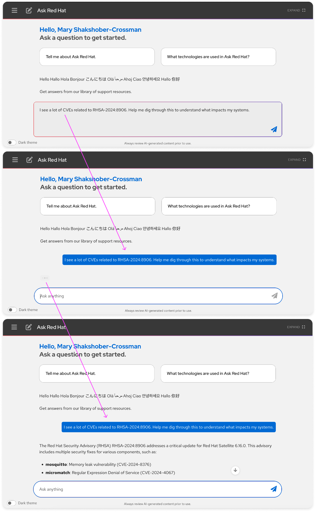
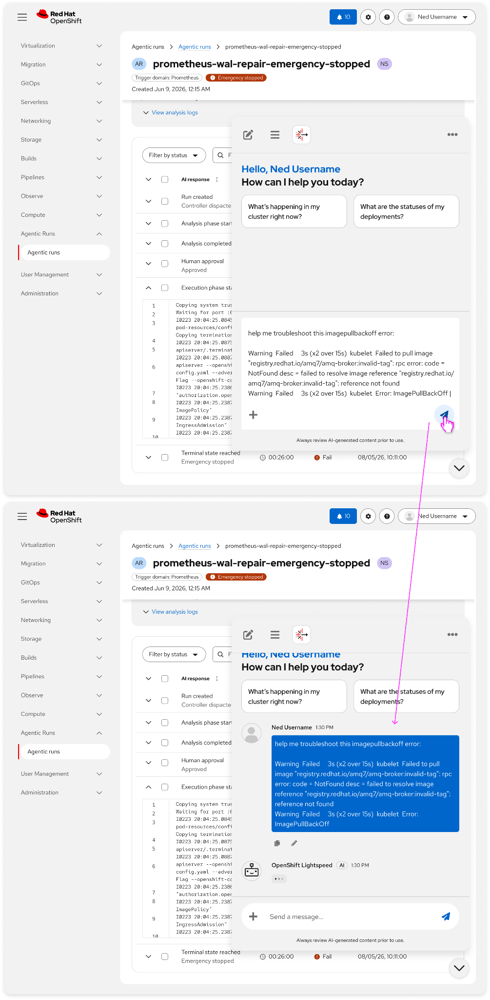

# Raw text input

## Overview
Raw text input is free-form natural language entry that lets users communicate with AI without mapping their request to a preset form or intent. It typically appears in chatbot message bars, in-page assistants, and other composer surfaces where users type or paste prompts, error dumps, API objects, or diagnostic notes. The defining trait is maximum expression: users write in their own words, across multiple lines, while the system still offers progressive guidance and shows what it understood.

---
## Purpose and value
- **Natural expression:** Let users describe problems and goals in human language instead of forcing a catalog of intents.
- **Diagnostic paste:** Accept pasted error messages, logs, and API objects as first-class input. OpenShift Lightspeed telemetry shows 81% of attachments are this kind of diagnostic content.
- **Easy refinement:** Make it simple to edit, clarify, and resubmit without starting over or losing pasted context. (, [NNGroup (cited in "Forms vs Chat")](https://medium.com/design-bootcamp/forms-vs-chat-stop-picking-a-side-and-start-designing-the-boundary-a012b962de6e), [IBM Iterative Prompting](https://www.ibm.com/think/topics/iterative-prompting))
---
## When to use
- **Open-ended troubleshooting:** The user is describing a problem they have not yet classified, and a short list of actions would be incomplete. In this way, the user can continue a thread in their own words after an earlier answer. (, [Multigrid "Chat vs Forms vs Inline"](https://multigrid.ai/learn/ai-interaction-patterns))
- **Pasting artifacts:** The fastest path is to paste an error message, YAML, JSON, command output, or API object into the composer.
- **Conversational communication:** Support the interaction mode users already choose at scale. For example, offer examples, helper text, or suggestions when users stall, without turning the composer into a form.
- **Unknown or mixed intent:** The system cannot reasonably present a complete set of structured fields up front. ([Multigrid "Chat vs Forms vs Inline"](https://multigrid.ai/learn/ai-interaction-patterns), [UX Planet "AI chat or not?"](https://uxplanet.org/ai-chat-or-not-if-its-a-form-it-should-stay-a-form-0294c59332d6))
- **Multi-line formatting:** The input includes code, logs, or structured text that must preserve whitespace and line breaks. ([Frontend Patterns "Prompt Input"](https://frontendpatterns.dev/prompt-input))
---
## When not to use
Additionally, when the task always needs the same data (cluster, namespace, severity), collect those with structured fields and keep free text for the remainder. ([UX Planet "AI chat or not?"](https://uxplanet.org/ai-chat-or-not-if-its-a-form-it-should-stay-a-form-0294c59332d6), [Multigrid "Chat vs Forms vs Inline"](https://multigrid.ai/learn/ai-interaction-patterns), [Smashing Magazine "Matching AI Modality To User Intent"](https://www.smashingmagazine.com/2026/07/matching-ai-modality-user-intent-designing-right-interface/))
(,, [NNGroup articulation barrier](https://medium.com/design-bootcamp/the-blank-prompt-problem-why-ai-products-are-failing-their-first-session-5e74bcb00b09), [Jakob Nielsen "76 Open Research Questions"](https://jakobnielsenphd.substack.com/p/ai-ux-research), [Chat Is the Wrong Interface](https://tianpan.co/blog/2026-07-04-chat-is-the-wrong-interface))
- **No echo of understanding:** If the system never restates what it parsed, users cannot correct it. ([Restatement checkpoint research](https://grais.ai/research/restatement-checkpoint-before-action), [Intermediate confirmation study](https://arxiv.org/html/2510.05307), [Agentic LLM feedback study](https://arxiv.org/pdf/2602.15569))
- **Secret required phrasing:** Do not require hidden prompt syntax, slash commands, or magic wording without making that syntax visible and optional. ([Nielsen Heuristic 6, Recognition Rather Than Recall](https://www.uxtigers.com/post/10-heuristics-reimagined), [Microsoft Teams Agent Slash Commands](https://learn.microsoft.com/en-us/microsoftteams/platform/agents-in-teams/agent-slash-commands), [NNGroup AI Discoverability](https://www.nngroup.com/articles/designing-ai-study-guide/), [AI UX Design Guide](https://www.aiuxdesign.guide/guides/conversational-ui-guide/suggested-prompts-and-conversation-starters))
- **High-risk execution as the only control:** Free-form text can describe an action, but irreversible or privileged operations still need confirmation. See Action confirmation. ([The Case for Friction in AI UX](https://www.spread.ai/resources/stories/the-case-for-friction-in-ai-ux-why-accept-all-is-the-wrong-pattern), [Intermediate confirmation study](https://arxiv.org/html/2510.05307))
---
## Examples and visualizations
*Screenshots below may not match existing implementations in products.*

#### Simple text input (Ask Red Hat example)
For general topic inquiries, questions, and general text inputs, Ask Red Hat uses the [message bar](https://www.patternfly.org/patternfly-ai/chatbot/chatbot-footer/) from PatternFly. Ask Red Hat is used at scale as an unconstrained natural language channel. Because of its conversational nature, there is no requirement that users know product-specific prompt templates.

#### Longer-form error or log message inputs (OpenShift Lightspeed)
Users often paste error messages, logs, and API objects directly into AI text input areas in order to troubleshoot, analyze, and parse through dense information. By default, the PF text input area of the chatbot expands to fit the user input, adding a scroll region if necessary. If it’s expected that users will need to upload very long bodies of text (multiple pages of content), it’s recommended that you allow users to upload a [file attachment](https://www.patternfly.org/patternfly-ai/chatbot/chatbot-attachments/react-demos) containing the text as well

---
## Recommended components
- **[Message bar](https://www.patternfly.org/patternfly-ai/chatbot/chatbot-footer/):** The Chatbot footer input for sending messages. Used here as the primary multi-line composer, with optional attach and microphone controls.
- **[Chatbot](https://www.patternfly.org/patternfly-ai/chatbot/overview):** The PatternFly Chatbot extension that hosts the message bar, welcome prompt, and conversation. Use this hierarchy instead of a custom chat UI.
- **[Text area](https://www.patternfly.org/components/text-area):** A multi-line form control for input longer than a single line. Use auto-resize when raw text lives outside a chatbot (in-page assistants, tickets, or diagnostic drawers).
- **[Helper text](https://www.patternfly.org/components/helper-text):** Short, always-visible hints under an input. Use it for character or paste limits, supported formats, and how to refine a prompt.
- **[Chatbot attachments](https://www.patternfly.org/patternfly-ai/chatbot/chatbot-attachments/react-demos):** Upload, preview, and error handling for files sent with a message. Companion to paste, not a replacement for raw text.
---
## Related standards
- Resource mentions
---
## Notes for PatternFly
- **Interpretation echo:** Message bar and text area capture input, but PatternFly does not document a pattern for restating what the AI understood from unstructured text before it acts.
- **Very long pastes:** Users paste error dumps and API objects that can exceed a comfortable composer height or model context window. There is little guidance for truncation, “summarize before send,” or token/character limits in the message bar.
- **Formatting preservation:** Pasted YAML, JSON, and logs need whitespace and line breaks kept intact. Chatbot content handles markdown in output; input-side formatting guarantees are not spelled out.
---
## Assumptions and research questions
#### Research questions
1. What proportion of inputs are diagnostic pastes vs. natural language questions vs. mixed content?
2. When users receive AI interpretation, how often do they correct it?
